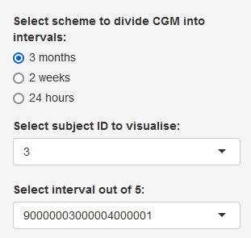
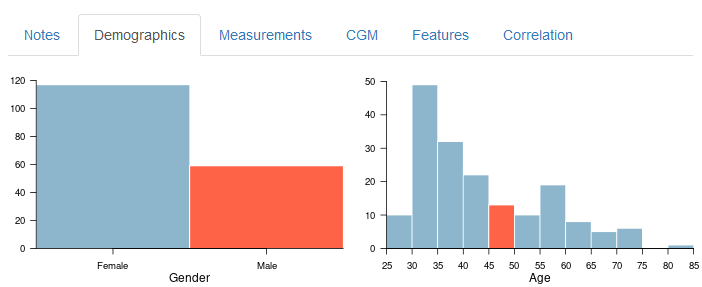
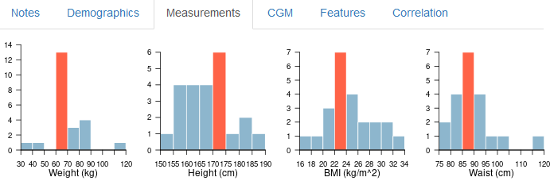
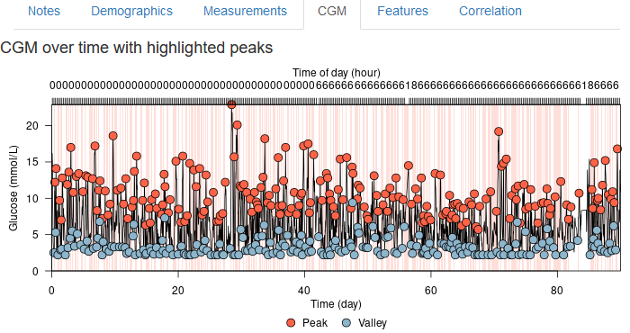
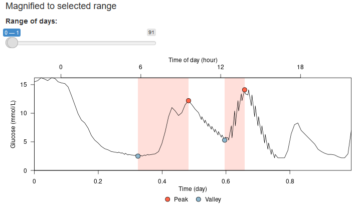
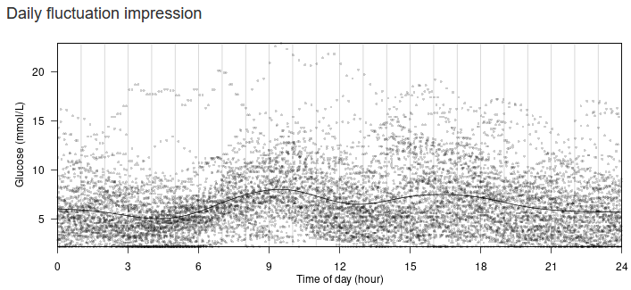
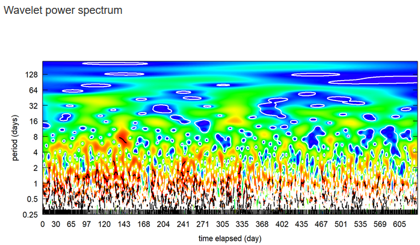
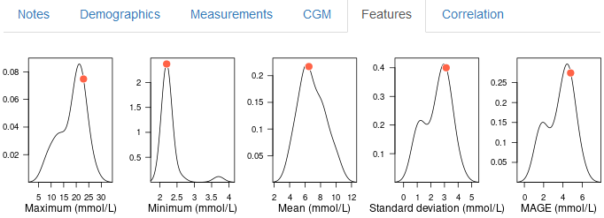
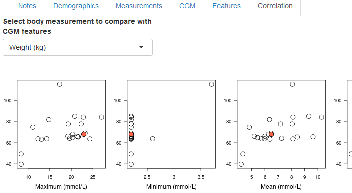

# GlucoseAPP
This repository bundles the R code that built Shiny APP [(link)](https://sshsphdemos.shinyapps.io/GlucoseAPP/). 
For purpose of safe keeping, all relevent code supporting the app is stored in the repository. 
Users are welcome to run the app on their local machine. Thanks for your support!

# What the app does

This interactive html page will guide you through data visualization of continuous glucose monitoring (CGM) and preliminary analysis. For full details of the study, refer to publication (pending submission). Subjects participated in the analysis were anonymized, each utilised CGM recording device with a period between 1 day and 1085 days. The wearable device captured CGM data intermittently roughly every 15 minutes, though gaps persist for various reasons such as battery drainage. Therefore this page was developed with the aim to visualise raw and processed data including time dependent CGM data,  the demographic distributions, aggregated CGM features, etc. to present a big picture and to aid through study. Not all analysis in the published manuscript is included. Below is a guide of how to utilize this page, including a control panel on the left, 6 tabs on the right, with the current page as default display.

# Left panel

In the left-side panel, select from three fields: length of interval, subject ID, interval ID. For easier visulisation, the historical CGM records are divided into intervals of 3 months, 2 weeks and 24 hours. The length of interval facilitates subsequent analysis, as CGM will be aggregated based on the intervals. The selected subject and interval ID will be used as filters to pass to tab 'CGM' or as indicators for remaining tabs, marking as red dots in contrast to overall distribution.

*BTW, after switching choices, background algorithm takes a few seconds to render new plots*

# Demographics

Two demographic variables: gender and age are summarised in histograms, with highlighted bar indicating the category or range where selected subject ID falls in.

# Measurements

Distributions of physical measurements shown in the form of histogram, including: Weight (kg), Height (cm), BMI (kg/m^2), Waist (cm), Hip (cm), Waist/hip, HbA1c (%), SBP (mmHg), DBP (mmHg), LDL (mg/dL), HDL (mg/dL), Triglycerides (mg/dL), with the highlighted bar indicating the range where selected subject ID falls in.

# CGM

The time dependent CGM records of selected subject and selected interval are presented in this tab.

## CGM over time with highlighted peaks

All CGM records along time for the selected subject ID and interval ID. There are two time axis, on the bottom is the number of days, on the top is hour in a day. CGM records are plotted in black curve, and highlighted dots indicate peak and valley positions (search algorithm is detailed in published paper). Semi-transparent regions highlight the period of increase from valley to peak.

## Magnified to selected range

By choosing the time window in the slider, the plot shown above is zoomed in to selected window.

## Daily fluctuation impression

In general, people follow the same daily routine, so will this be reflected in glucose pattern.
This plot shows CGM trend in a day of 24 hours by collapsing time variable into the same day.
Semi-transparent dots indicated actual CGM recordings. Solid black curve is the fitted spline curve after modeling with general additive models.

## Wavelet power spectrum

The frequency pattern of CGM is further illustrated in the wavelet power spectrum plot. The entire history of selected subject ID is used to generate the plot. Red color indicates strong repetition in period of days, blue color indicates weak repetition.

# Features

All CGM intervals of selected scheme of division are pooled together and aggregated into features: 
Maximum (mmol/L), Minimum (mmol/L), Mean (mmol/L), Standard deviation (mmol/L), MAGE (mmol/L), p(CGM>13.9mmol/L), p(CGM>10.0), p(3.9<CGM<10.0), p(CGM<3.9), p(CGM<3.0), Rise (mmol/L), Fall (mmol/L), Rise rate (mmol/L/h), Fall rate (mmol/L/h), 
Delta at 24 hours of day from 00:00 to 23:00 (mmol/L).
Details are described in published paper.
The CGM interval of chosen subject ID and interval ID is indicated in red dots to compare with the density distribution of respective features.

# Correlation

To investigate trend between CGM features and physical measurements, pairwise scatterplots are drawn for measurement chosen in the selection box and all features. Remember that one subject corresponds to one set of measurements and several feature sets, hence repeating values in y axis are captured. Similarly to Demographics, Measurements and Features tabs, red dots highlight the selected interval ID in comparison to overall distribution.

